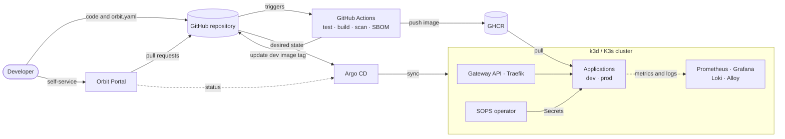

# Orbit Architecture

## Overview

Orbit is an Internal Developer Platform that provides a standardized
application delivery workflow — the **Golden Path**. Developers describe an
application in a short manifest; Orbit builds, secures, deploys, routes and
observes it.

Orbit runs entirely on a single laptop at no cost
([ADR-0001](decisions/0001-local-first-zero-cost-runtime.md)).

## Architecture principles

- Git as the source of truth
- Automated delivery
- Reproducible infrastructure
- Standardized application deployment
- Developer self-service
- Security integrated into the delivery lifecycle
- Observable workloads
- Every component has a clear purpose and fits the resource budget

## High-level architecture



## Developer workflow

1. A developer adds an application with an `orbit.yaml` manifest — by hand or
   through the portal ([ADR-0002](decisions/0002-developer-contract.md)).
2. Merging to `main` triggers CI: test, build, vulnerability scan, SBOM, push
   to GHCR ([ADR-0008](decisions/0008-ci-and-supply-chain-security.md)).
3. CI updates the application's dev image tag in Git; Argo CD deploys it to
   `dev` ([ADR-0003](decisions/0003-gitops-delivery-with-argo-cd.md)).
4. Promotion to `prod` is a pull request that copies the tested tag
   ([ADR-0004](decisions/0004-environments-and-promotion.md)).
5. The application is reachable at `<app>.<env>.localhost` and observable
   without extra configuration
   ([ADR-0005](decisions/0005-gateway-api-with-traefik.md),
   [ADR-0009](decisions/0009-observability.md)).

## Components

| Capability | Technology | Decision |
|---|---|---|
| Local Kubernetes | k3d (K3s) | [ADR-0001](decisions/0001-local-first-zero-cost-runtime.md) |
| Developer contract | Orbit manifest + Golden Path Helm chart | [ADR-0002](decisions/0002-developer-contract.md) |
| GitOps | Argo CD + ApplicationSets | [ADR-0003](decisions/0003-gitops-delivery-with-argo-cd.md) |
| Environments | `dev`, `prod`; promotion by pull request | [ADR-0004](decisions/0004-environments-and-promotion.md) |
| Routing | Gateway API + Traefik | [ADR-0005](decisions/0005-gateway-api-with-traefik.md) |
| Secrets | SOPS + age, decrypted in-cluster | [ADR-0006](decisions/0006-secrets-with-sops-and-age.md) |
| Developer portal | React, TypeScript, Vite + Go backend | [ADR-0007](decisions/0007-developer-portal.md) |
| CI and registry | GitHub Actions + GHCR | [ADR-0008](decisions/0008-ci-and-supply-chain-security.md) |
| Supply-chain security | Trivy (scanning, SBOM); cosign later | [ADR-0008](decisions/0008-ci-and-supply-chain-security.md) |
| Observability | Prometheus, Grafana, Loki, Alloy | [ADR-0009](decisions/0009-observability.md) |
| Policy | Kyverno | [ADR-0010](decisions/0010-policy-enforcement-with-kyverno.md) |
| Platform services | Go | [ADR-0011](decisions/0011-go-for-platform-services.md) |

## Repository layout

```text
apps/              application source code (sample workload, portal)
helm/orbit-app/    Golden Path chart
gitops/
  bootstrap/       root Application
  platform/        platform components
  apps/<name>/     orbit.yaml, env/dev.yaml, env/prod.yaml
infrastructure/    local cluster configuration and bootstrap scripts
docs/              architecture, deployment and operations documentation
```

## Resource budget

| Scope | Memory target |
|---|---|
| Core platform | ≤ 1.5 GiB |
| All optional capabilities enabled | ≤ 3 GiB |

Measured values are documented under [`docs/operations`](../operations/) as
capabilities are added.

## Decisions

All architecture decisions are recorded in [`decisions/`](decisions/README.md).
